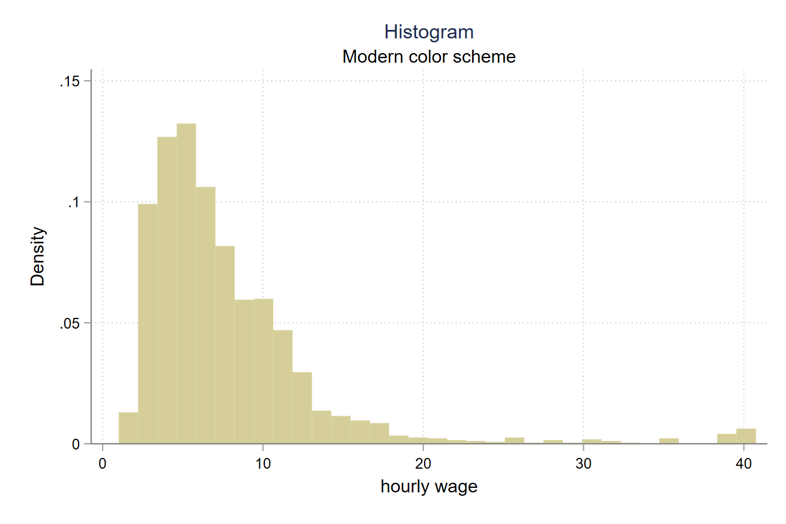
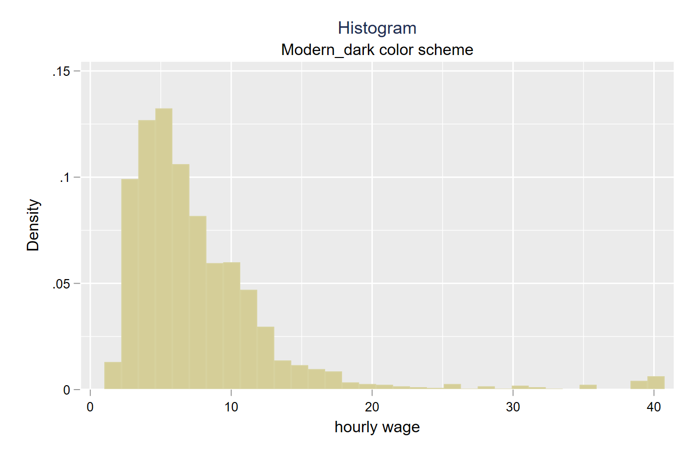
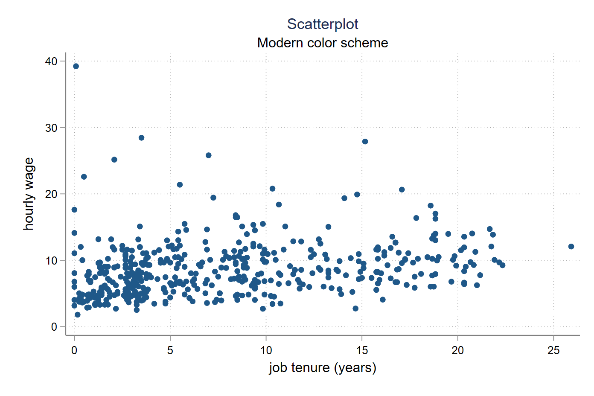
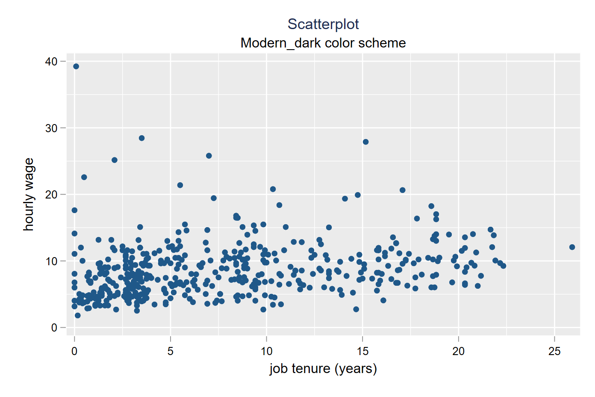
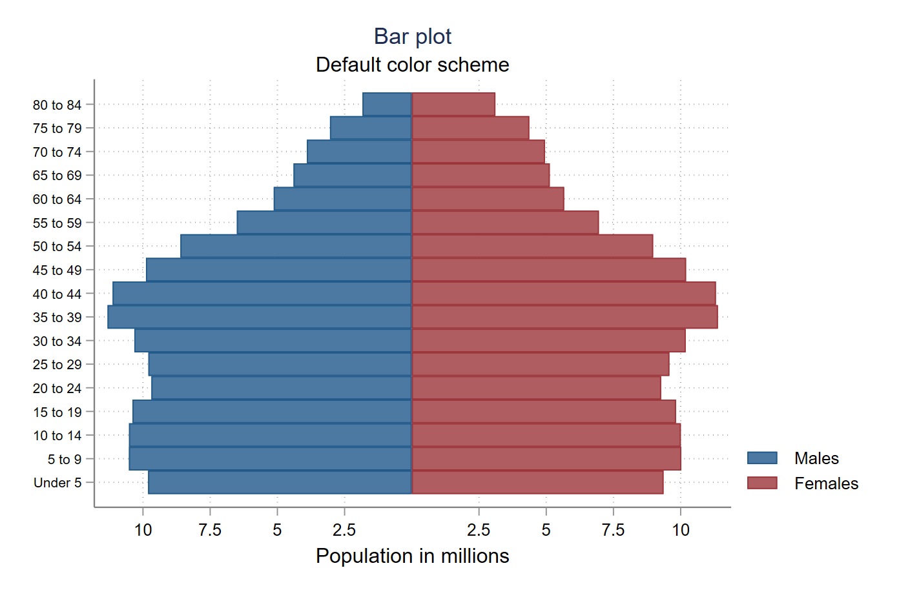
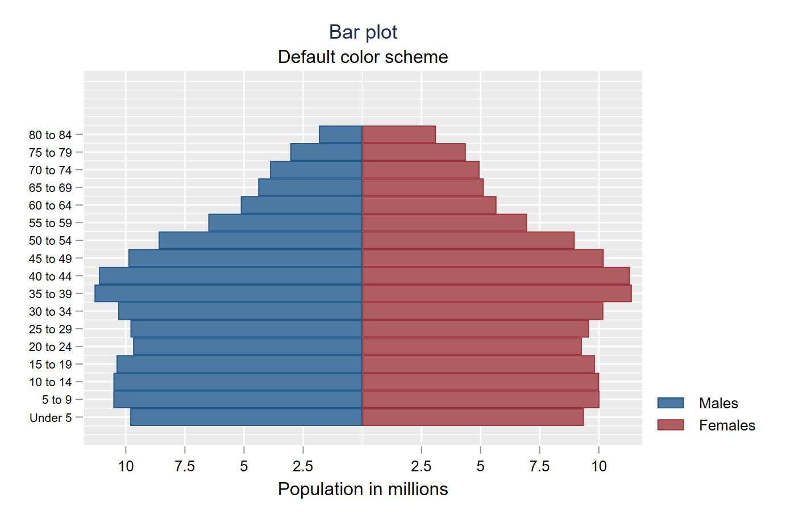
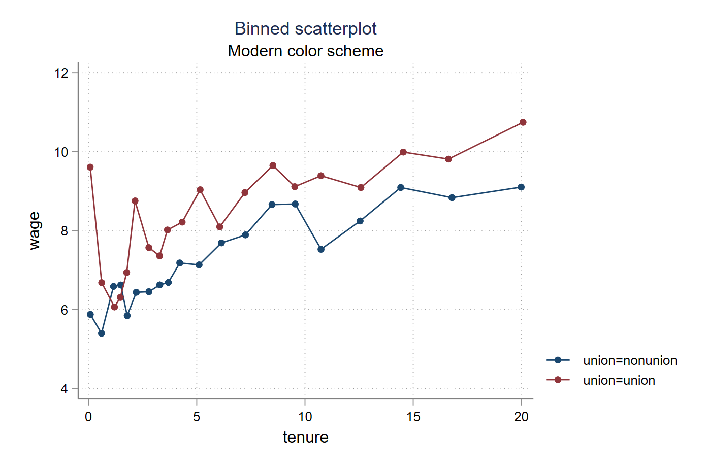
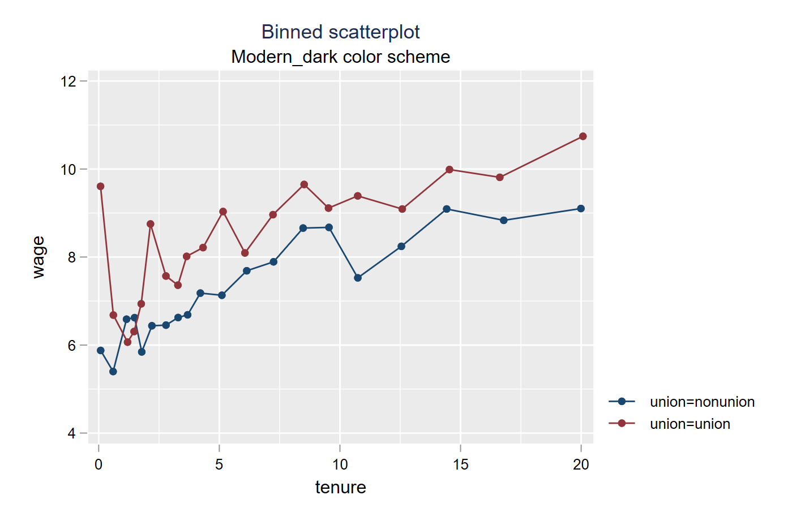
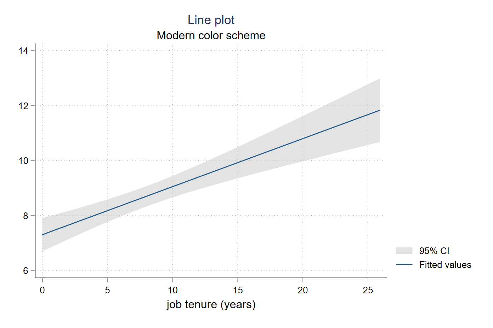
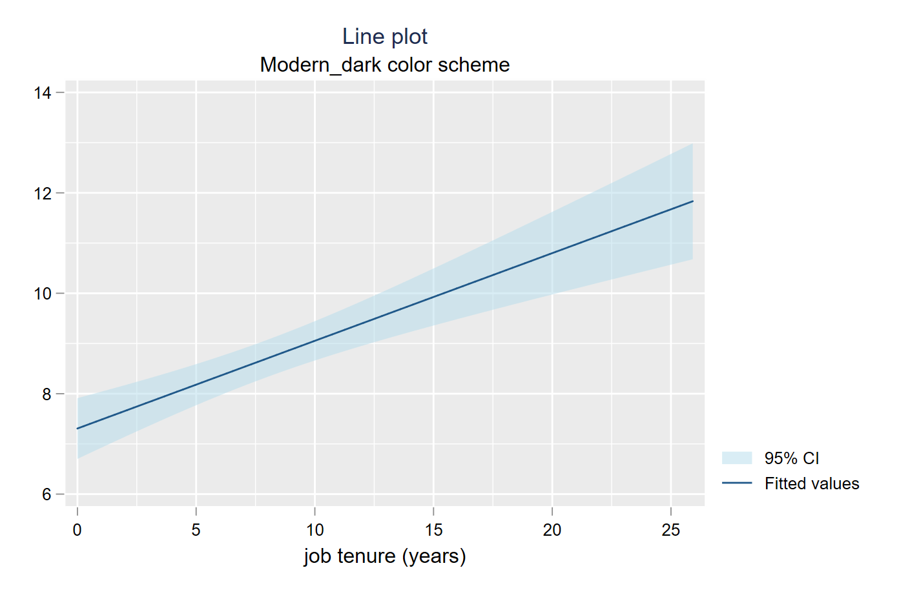

stata-scheme-modern
=================================

[Overview](#overview)
| [Installation](#installation)
| [Screenshots](#screenshots)
| [Benchmarks](#benchmarks)
| [To-Do](#todo)
| [Acknowledgements](#acknowledgements)

Pretty graphical schemes to replace Stata defaults

`version 1.0 1jul2019`


Overview
---------------------------------

Stata's default graphics don't look that good. This program provides two replacement schemes that look better. You can check out some pictures of what these schemes look like in the [Screenshots](#screenshots) section below. Note that these scheme options - for instance, placing the content of legends outside the graph region - can always be overrided. The purpose of these schemes is to provide default options that are closer to what you might want and look better out of the box.


Installation
---------------------------------

Installing and using these schemes is straightforward.

1. Install both packages from this GitHub repository by typing the following command at the command line:

```stata
net install scheme-modern, from("https://raw.githubusercontent.com/mdroste/stata-scheme-modern/master/")
```

2. To use the light-colored theme, simply type:
```stata
set scheme modern, perm
```

3. To use the dark-colored theme instead, simply type:
```stata
set scheme modern_dark, perm
```


Screenshots
---------------------------------


<details>

<summary>Click for histogram example</summary>

")





</details>
<details>
<summary>Click for scatterplot example</summary>

")





</details>
<details>
<summary>Click for bar chart example</summary>

")





</details>
<details>
<summary>Click for binned scatterplot example</summary>

")





</details>
<details>
<summary>Click for line plot example</summary>

")





</details>


Acknowledgements
---------------------------------

These schemes were built by combining elements from two existing schemes: (1) the leap-slides used by the Opportunity Insights research group from 2015 to present; (2) the [cleanplots](https://www.trentonmize.com/software/cleanplots) scheme produced by Trenton D. Mize.

Interested users might also like to check out other work; for instance, the [grstyle](https://boris.unibe.ch/117391/1/grstyle-Konstanz-2018.pdf) command by Ben Jann.
